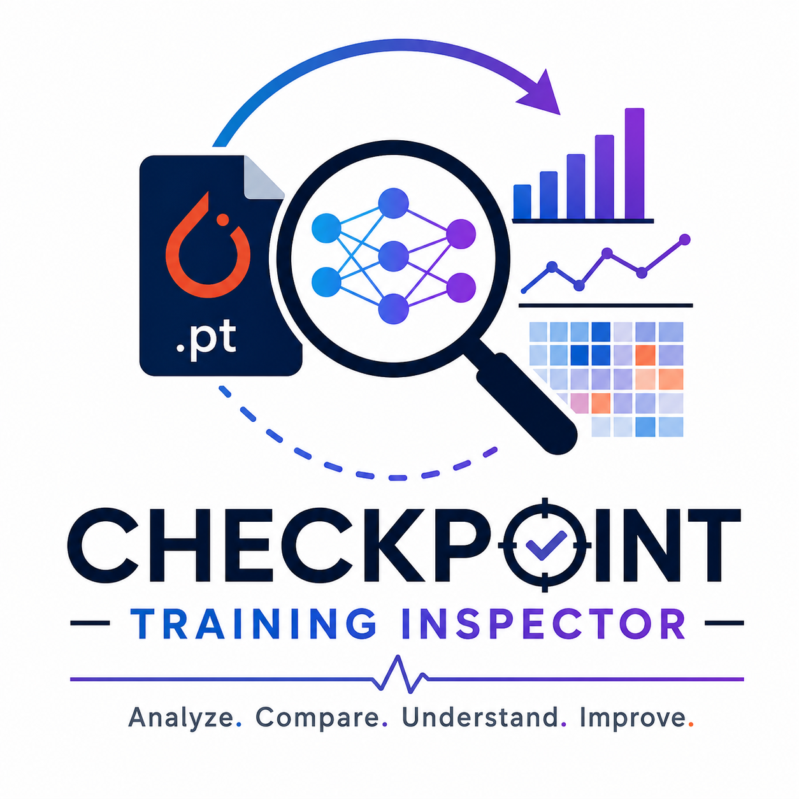

# Checkpoint Training Inspector (CTI)

<p align="center">
  
</p>

<p align="center">
  <a href="https://www.python.org/downloads/"></a>
  <a href="LICENSE"></a>
  <a href="https://streamlit.io"></a>
  <a href="https://pytorch.org"></a>
  
</p>

<p align="center">
  Offline Streamlit dashboard for inspecting PyTorch checkpoints — layer drift, anomaly detection, singular-value spectra, training trajectories, gradient probes, and smart HTML reports. No data leaves your machine.
</p>

---

## Table of Contents

- [Why Use It](#why-use-it)
- [Quick Start](#quick-start)
- [Demo Checkpoints](#demo-checkpoints)
- [Supported Checkpoints](#supported-checkpoints)
- [App Modes](#app-modes)
- [Recommended Workflow](#recommended-workflow)
- [Privacy and Safety](#privacy-and-safety)
- [Project Structure](#project-structure)
- [Development](#development)
- [Roadmap Ideas](#roadmap-ideas)
- [Contributing](#contributing)
- [License](#license)

---

## Why Use It

- Compare two checkpoints layer by layer — weights, norms, and cosine similarity.
- Flag **frozen**, **exploding**, **dead**, or **cosine-collapsed** layers automatically.
- Analyze singular-value spectra, effective rank, and weight-norm changes.
- Track checkpoint trajectories across many epochs with spike and plateau detection.
- Probe gradients with your own model, batch, and loss code.
- Export CSV tables and a narrative HTML report for sharing with teammates.
- Works **fully offline** with local checkpoint files — nothing is uploaded.

---

## Quick Start

**Requires Python 3.10+**

```bash
git clone https://github.com/YOUR-USERNAME/checkpoint-training-inspector.git
cd checkpoint-training-inspector
python -m venv .venv
```

Activate the environment:

```bash
# Windows PowerShell
.\.venv\Scripts\Activate.ps1

# macOS / Linux
source .venv/bin/activate
```

Install dependencies and launch:

```bash
pip install -r requirements.txt
streamlit run app.py
```

Open the URL that Streamlit prints — usually `http://localhost:8501`.

---

## Demo Checkpoints

Try the app immediately without your own model files. Generate sample PyTorch checkpoints from the command line:

```bash
python train_demo.py --out_dir sample_training_checkpoints --epochs 5
```

Or click **Sample Data** in the app sidebar and use the built-in generator.

---

## Supported Checkpoints

CTI accepts `.pt`, `.pth`, and `.bin` files uploaded individually or bundled in a `.zip` archive.

Supported layouts:

| Layout | Example key |
| --- | --- |
| Raw state dict | *(top-level tensors)* |
| Nested state dict | `state_dict`, `model_state_dict`, `model`, `net`, `network`, `weights`, `module` |
| With optimizer state | `optimizer_state_dict`, `optimizer`, `optim_state_dict`, `opt_state_dict` |
| DataParallel / DDP | `module.` prefix stripped automatically |

All tensors are loaded on CPU.

---

## App Modes

| Mode | What it does |
| --- | --- |
| **Checkpoint Diff** | Compare two checkpoints, rank layer drift, group modules, show optimizer-state movement, export reports. |
| **Anomaly Detection** | Flag frozen, exploding, dead, or cosine-collapsed layers with adjustable thresholds. |
| **Representation Analysis** | Compare singular-value spectra, effective rank, and weight-norm changes. |
| **Trajectory** | Upload many checkpoints and track global/module drift across training epochs. |
| **Gradient Probe** | Execute local model, batch, and loss code to compare gradient behavior between checkpoints. |
| **Sample Data** | Generate small demo checkpoints for testing the workflow. |
| **About** | Overview, feature comparison (V2 vs V3), and recommended workflow. |

---

## Recommended Workflow

1. Generate or collect checkpoints from several training epochs.
2. Open **Checkpoint Diff** with an early and a late checkpoint — review health scorecards.
3. Use **Anomaly Detection** to automatically flag frozen or unstable layers.
4. Use **Representation Analysis** to inspect rank and capacity changes.
5. Use **Trajectory** with all epoch checkpoints to find spikes or plateaus.
6. Use **Gradient Probe** only with trusted local code when you need gradient diagnostics.

---

## Privacy and Safety

The app is designed to run locally. Uploaded checkpoints are processed in your Streamlit session and are not intentionally sent anywhere by this project.

**Important safety notes:**

- PyTorch checkpoint files may contain unsafe pickle payloads. CTI first tries `torch.load(..., weights_only=True)` and falls back for compatibility. **Only inspect checkpoints you trust.**
- The **Gradient Probe** mode executes pasted Python code in your local process. Use it only in a trusted local environment.
- Large model checkpoints can use significant RAM and CPU, especially during singular-value analysis.

See [SECURITY.md](SECURITY.md) for the full security policy.

---

## Project Structure

```text
.
├── app.py                          # Streamlit interface (all UI modes)
├── train_demo.py                   # Demo checkpoint generator
├── requirements.txt                # Runtime dependencies
├── logo.png                        # Project logo
├── checkpoint_inspector/
│   ├── __init__.py                 # Package version
│   ├── loader.py                   # Checkpoint loading and state_dict extraction
│   ├── metrics.py                  # Layer, group, histogram, and optimizer metrics
│   ├── anomaly.py                  # Layer and trajectory anomaly detection
│   ├── similarity.py               # Singular values, effective rank, norm changes
│   └── report.py                   # HTML report generation
├── .github/
│   ├── ISSUE_TEMPLATE/
│   │   ├── bug_report.md
│   │   └── feature_request.md
│   └── pull_request_template.md
├── CONTRIBUTING.md
├── SECURITY.md
└── LICENSE
```

---

## Development

Install dependencies:

```bash
pip install -r requirements.txt
```

Run a quick syntax check across all modules:

```bash
python -m compileall app.py train_demo.py checkpoint_inspector
```

Launch the app:

```bash
streamlit run app.py
```

No formal test suite exists yet — see [Roadmap Ideas](#roadmap-ideas) if you want to contribute one.

---

## Roadmap Ideas

- Add a command-line report generator (`cti report ckpt_a.pth ckpt_b.pth`).
- Add unit tests for checkpoint parsing and anomaly thresholds.
- Add example screenshots to this README.
- Add PyPI packaging metadata (`pyproject.toml`).
- Add richer support for LoRA / adapter and transformer naming conventions.
- Support SafeTensors format (`.safetensors`).

---

## Contributing

Contributions are welcome. Please read [CONTRIBUTING.md](CONTRIBUTING.md) for setup instructions and pull-request guidelines.

---

## License

Released under the [MIT License](LICENSE). © 2026 Checkpoint Training Inspector contributors.
